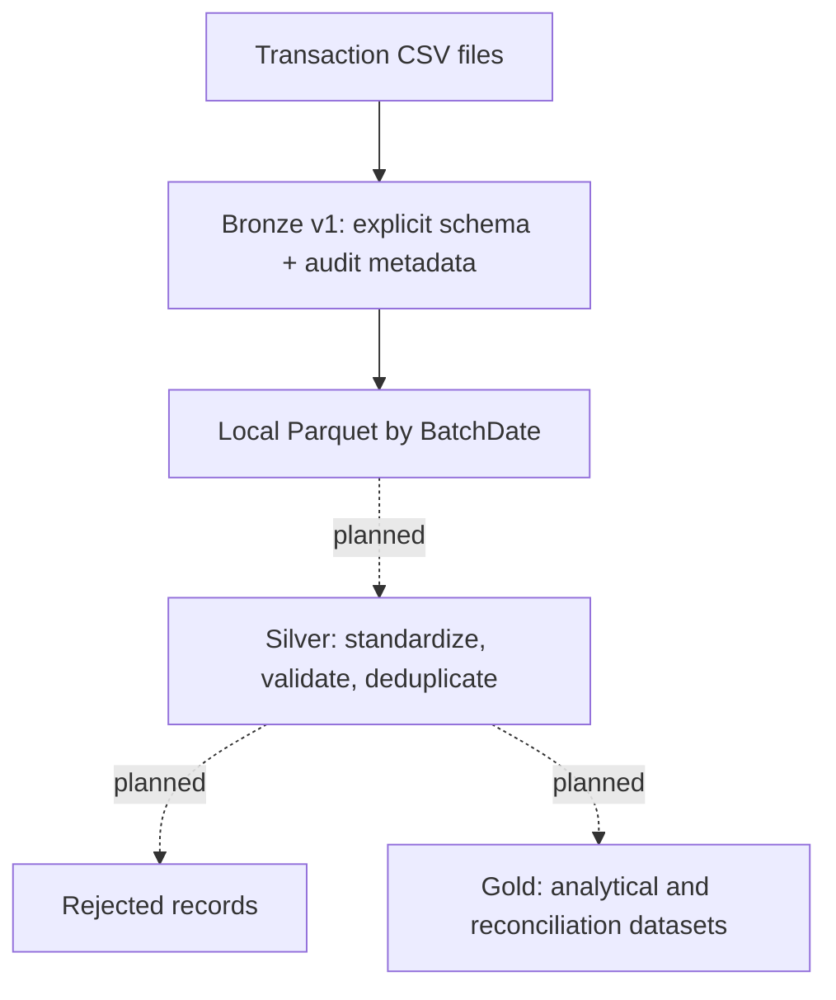

# Financial Transaction Lakehouse ETL Pipeline

An independent data-engineering portfolio project demonstrating ETL design across two complementary implementations: a completed SQL Server pipeline for staged relational processing and an in-progress financial transaction lakehouse pipeline using Python and PySpark. The project is for learning and technical demonstration; it is not a production financial platform and does not represent professional Databricks experience.

## Project overview

The repository began as a SQL Server ETL lab and now extends those data-engineering concepts into a medallion-style financial transaction pipeline.

The SQL Server implementation loads source data through `src`, `stg`, and `rpt` schemas, including validation, change detection, SCD Type 2 dimensions, fact loading, ETL run tracking, and transactional orchestration.

The PySpark implementation currently provides **Bronze v1**. Transaction CSV files are loaded with an explicit schema, preserved as source-faithful nullable strings, enriched with audit metadata, and persisted as batch-partitioned Parquet. Rerunning a batch replaces only that batch partition. Silver validation and Gold analytical datasets are intentionally deferred.

## Current status

| Area | Status | Repository evidence |
| --- | --- | --- |
| SQL Server repository foundation | Implemented | `sql/schema/`, `sql/staging/`, `sql/reporting/`, and `sql/etl/` |
| SQL Server staged ETL | Implemented | Staging load procedures, validation messages, reporting loads, and `sql/etl/010_run_pipeline_proc.sql` |
| SQL Server dimensional history | Implemented | Customer and product SCD Type 2 migration/load scripts and historical fact-key resolution |
| Financial explicit PySpark schema | Implemented | `financial-pipeline/src/bronze_transactions.py` defines all six source fields as nullable `StringType` columns |
| Bronze CSV ingestion | Validated under WSL/Linux | Configurable file/directory ingestion with explicit header validation |
| Bronze audit metadata | Validated under WSL/Linux | `SourceFile`, `IngestedAtUtc`, and `BatchDate` |
| Bronze persistence and rerun safety | Validated under WSL/Linux | Batch-specific Parquet output written with overwrite only at `BatchDate=YYYY-MM-DD`; same-batch reruns preserve sibling batch partitions |
| Bronze automated validation | Validated under WSL/Linux | `financial-pipeline/tests/test_bronze_transactions.py` passes all 3 tests covering schema, metadata, persistence, reruns, partition preservation, and failure cases |
| Silver transformations | Planned | No Silver transformation code exists yet |
| Financial data-quality rules | Planned | Malformed values are preserved in Bronze; business validation is deferred to Silver |
| Gold reporting layer | Planned | No financial Gold datasets exist yet |
| Delta Lake persistence | Planned | Bronze v1 uses local Parquet only |
| Databricks execution | Planned | Databricks-compatible direction only; not validated on a Databricks workspace |
| Pipeline orchestration | Planned for PySpark | SQL Server orchestration exists; PySpark orchestration does not |
| CI/CD | Planned | No CI workflow is currently included |

## Architecture



Bronze is deliberately source-faithful. Silver will own business interpretation and data-quality decisions; Gold will own analysis-ready datasets and metrics.

## Data model and Bronze behavior

The transaction source contract is:

| Source column | Bronze type | Notes |
| --- | --- | --- |
| `TransactionId` | string, nullable | Preserved as received |
| `AccountId` | string, nullable | Preserved as received |
| `CreatedDate` | string, nullable | Invalid dates remain observable for later validation |
| `Amount` | string, nullable | Blank, malformed, and signed values are not corrected in Bronze |
| `Currency` | string, nullable | Reference validation is deferred |
| `TransactionType` | string, nullable | Empty or unsupported values are not normalized in Bronze |

All six fields remain nullable strings so ingestion does not silently convert or reject malformed business data. The current sample intentionally contains examples such as whitespace amounts, a malformed date, a duplicate transaction identifier, missing transaction type, an unknown account, and values requiring later business validation.

Bronze adds three audit columns:

- `SourceFile` records the physical source file reported by Spark's `input_file_name()`.
- `IngestedAtUtc` records ingestion time. The Spark session timezone is explicitly set to UTC.
- `BatchDate` is a validated `DateType` value supplied by the execution command.

Spark can apply an explicit CSV schema positionally, so the script validates the source header **before** loading. The header must contain exactly the six expected columns **in the documented order**. This prevents a reordered file from being silently mapped to the wrong fields.

For rerun safety, each execution writes only to:

```text
financial-pipeline/data/bronze/transactions/BatchDate=YYYY-MM-DD/
```

That batch directory is overwritten on a rerun while sibling batch directories remain untouched. Generated Parquet data is excluded from Git.

## Repository layout

```text
sql-data-engineering-lab/
├── financial-pipeline/
│   ├── data/
│   │   └── raw/
│   │       └── transactions/
│   │           └── transactions_2026-09-01.csv
│   ├── src/
│   │   └── bronze_transactions.py
│   ├── tests/
│   │   └── test_bronze_transactions.py
│   └── requirements.txt
├── sample-data/
│   └── 001_seed_source_data.sql
├── spark/
│   ├── 01_dataframe_basics.py
│   └── 01_dataframe_basics.ipynb
├── sql/
│   ├── schema/
│   ├── staging/
│   ├── reporting/
│   ├── etl/
│   └── transformations/
├── .gitignore
└── README.md
```

`financial-pipeline/` contains the financial Bronze milestone. `spark/` contains earlier PySpark learning exercises. The `sql/` and `sample-data/` directories preserve the original SQL Server ETL implementation.

## Running Bronze locally

The local environment used while developing this PySpark work uses Python 3.13, Java 17, and PySpark 4.2.0. PySpark is pinned in `financial-pipeline/requirements.txt`. Java must be available to Spark through the local environment (`JAVA_HOME` where required).
Bronze v1 persistence and automated tests were validated under Ubuntu on WSL2 using Python 3.14.4, Java 17.0.20.1, PySpark 4.2.0, and Spark's bundled Hadoop 3.5.0. The unchanged Bronze test suite passed all 3 tests. The included 10-row transaction sample was also persisted successfully, including execution from outside the repository directory, same-batch reruns without duplicate accumulation, and preservation of a second batch partition.

From Git Bash, activate the existing virtual environment and install dependencies if needed:

```bash
source .venv/Scripts/activate
python -m pip install -r financial-pipeline/requirements.txt
```

Run Bronze ingestion from the repository root:

```bash
python financial-pipeline/src/bronze_transactions.py \
  --input financial-pipeline/data/raw/transactions/transactions_2026-09-01.csv \
  --bronze-output-root financial-pipeline/data/bronze/transactions \
  --batch-date 2026-09-01
```

Relative arguments are resolved from the repository root determined from the script location, not from the caller's current working directory. Absolute paths are also accepted. This makes the same command arguments usable when the script is launched from another directory.

A successful run logs the resolved input path, batch date, source row count, written row count, and resolved output location. For the included sample file, the expected source and written counts are both 10. Output is Parquet under:

```text
financial-pipeline/data/bronze/transactions/
└── BatchDate=2026-09-01/
    ├── part-....snappy.parquet
    └── _SUCCESS
```

Run the deterministic Bronze tests with the standard-library test runner:

```bash
python -m unittest discover -s financial-pipeline/tests -p "test_*.py" -v
```

The tests use temporary input/output directories and do not depend on the repository's generated Bronze output.

## Engineering decisions

- **Explicit schemas instead of inference.** The source contract is visible in code and is not dependent on Spark sampling.
- **Header validation before Spark ingestion.** Because the supplied schema can be applied positionally, exact names and order are checked before loading.
- **Source-faithful Bronze values.** Business fields stay nullable strings so malformed values remain available for later classification rather than being silently corrected.
- **Audit lineage.** Source file, UTC ingestion timestamp, and caller-supplied batch date make each Bronze record traceable to an ingestion event.
- **Working-directory-independent paths.** Relative CLI paths resolve against the repository location derived from `__file__`.
- **Batch-scoped overwrite.** Rerunning one batch replaces only that batch directory, preventing duplicate accumulation while preserving other batches.
- **Persist once during count/write validation.** The Bronze DataFrame is persisted while it is counted and written, then explicitly released.
- **Layer separation.** Bronze ingestion does not trim, cast business fields, deduplicate, perform reference checks, or decide whether a financial record is valid.

## Data quality and validation

### Implemented in Bronze v1

Bronze performs ingestion-contract and operational validation only:

- input path must exist and contain at least one CSV file;
- each CSV header must match the six expected source columns in exact order;
- batch date must be valid `YYYY-MM-DD`;
- source and persisted row counts must match;
- automated tests verify source types, audit columns, requested batch date, Parquet read-back, same-batch rerun safety, and preservation of another batch partition.

### Planned for Silver

The following are intentionally **not** Bronze rules:

- required transaction/account identifiers;
- date parsing and business-valid date ranges;
- numeric amount parsing and null handling;
- transaction-type/sign consistency;
- supported currencies and transaction types;
- account/customer reference integrity;
- duplicate transaction detection and deterministic deduplication;
- accepted/rejected record separation with structured rejection reasons;
- row-count and control-total reconciliation.

## Roadmap

1. **Bronze v1 — complete:** explicit schema, header validation, audit metadata, configurable local execution, Parquet persistence, batch rerun safety, and automated smoke/integration tests.
2. Add Silver parsing, standardization, and data-quality rules while preserving Bronze source evidence.
3. Add structured rejected-record datasets and deterministic duplicate handling.
4. Add reconciliation controls for row counts and financial control totals.
5. Build Gold daily transaction, account-balance, exception, and month-over-month datasets.
6. Introduce Delta Lake persistence and MERGE-based incremental processing where it improves the design.
7. Add configurable local/Databricks execution and validate the pipeline on an actual Databricks workspace before claiming Databricks execution.
8. Add PySpark orchestration, structured run logging, and failure-recovery behavior.
9. Add CI validation and expand architecture/operational documentation.
10. Evaluate Spark query plans and performance behavior with appropriately larger test data.

## Limitations

- The financial data is synthetic practice data, not production financial data.
- Bronze v1 is batch-file ingestion; there is no streaming implementation.
- Bronze persistence is local Parquet, not Delta Lake.
- Silver business validation and Gold analytics are not implemented yet.
- The PySpark pipeline has not been deployed to cloud infrastructure or validated on Databricks.
- There is no production scheduler/orchestrator for the PySpark pipeline.
- CI/CD is not implemented.
- Performance has not been tested at production-scale data volumes.
- Security, access control, encryption, and secrets management are outside the current local milestone.
- Native Windows Parquet persistence is not supported in the tested local configuration: PySpark 4.2.0 with bundled Hadoop 3.5.0 failed during local Parquet writes because the Windows Hadoop filesystem path required `winutils.exe`/`HADOOP_HOME`. No unofficial Hadoop binaries or Windows-specific workaround were added; Bronze v1 persistence was instead validated under WSL2/Linux.

## Portfolio scope

This repository is an independent technical learning project. It demonstrates data-engineering reasoning and implementation practice with SQL Server, Python, and PySpark; it should not be interpreted as a production financial system, client engagement, or claim of professional Databricks/Spark experience.
